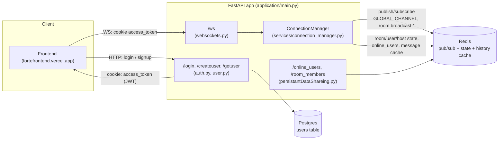

# Forte [🔗](https://fortefrontend.vercel.com)

Forte is a FastAPI backend for a real-time chat application. It provides JWT-based
authentication as well as cookies and a single WebSocket connection per client that supports a global
chat channel plus ad-hoc, host-owned "rooms." Redis is used both as the pub/sub
backbone (so the app can run behind multiple workers/instances) and as the
source of truth for room membership, online/offline presence, and short message
history. Postgres (via SQLAlchemy + Alembic) stores user accounts. Plan to add
room member, room details, host data in Postgres in future development.

## Table of contents

- [Architecture](#architecture)
- [Tech stack](#tech-stack)
- [Project structure](#project-structure)
- [Auth model & cookies](#auth-model--cookies)
- [Setup](#setup)
- [REST API reference](#rest-api-reference)
- [WebSocket protocol reference](#websocket-protocol-reference)
- [Redis key reference](#redis-key-reference)

## Architecture



Key points:

- Every process runs its own `ConnectionManager` (`application/services/connection_manager.py`),
  which holds **only the local, in-process** websocket objects (`active_connections` for
  global, `rooms` for room membership). Everything that needs to be shared across
  processes/instances — room existence, membership, host, per-user room list, presence
  counts, and the last 100 messages per channel — lives in **Redis**, not in memory.
- On startup (`lifespan` in `websockets.py`) the manager subscribes to the Redis
  `global_broadcast` channel and starts a background task (`_pubsub_listner_loop`) that
  fans incoming pub/sub messages out to whichever local websockets are relevant
  (global connections, or connections currently in a given room). This is what lets a
  message sent to one worker, reach clients connected to a different worker.
- Presence (`online_users` hash in Redis) is reference-counted per username, so the
  same user connected from multiple tabs/devices is only reported offline once every
  connection has dropped. redis hset is used for that purpose.

## Tech stack

- **FastAPI** (0.141.x) + **Starlette** websockets
- **SQLAlchemy** as ORM, **Alembic** for migrations, **Postgres** (Neon, `.env.example`)
- **Redis** (`redis.asyncio`) for pub/sub, room/presence state, and message history cache
- **python-jose** for JWT, **passlib[bcrypt]** for password hashing
- **Pydantic v2** / **pydantic-settings** for schemas and config
- **uvicorn** (dev) / **gunicorn + uvicorn workers** (prod)
- Deployed as a Docker image (`kiertolainen/forte:latest`)

## Project structure

```
forte-master/
├── application/
│   ├── main.py                # FastAPI app, CORS, router registration
│   ├── config.py              # pydantic-settings, reads .env
│   ├── database.py            # SQLAlchemy engine/session, get_db dependency
│   ├── models.py              # Users ORM model
│   ├── schemas.py             # Pydantic request/response/WS message schemas
│   ├── oauth2.py              # JWT creation/verification, HTTP + WS auth deps
│   ├── utils.py                # bcrypt hash/verify helpers
│   ├── routers/
│   │   ├── auth.py             # POST /login
│   │   ├── user.py             # POST /createuser, GET /getuser/{username}
│   │   ├── websockets.py       # WS /ws, lifespan (starts redis pubsub listener)
│   │   └── persistantDataShareing.py  # GET /online_users, GET /room_members
│   └── services/
│       └── connection_manager.py  # ConnectionManager: rooms, presence, pub/sub fanout
├── alembic/                    # migrations (env.py, versions/)
├── alembic.ini
├── Dockerfile
├── docker-compose-dev.yml      # api + postgres + redis
├── docker-compose-prod.yml     # api only (gunicorn), external Postgres/Redis
├── requirements.txt
└── .env.example
```

## Auth model & cookies

Login (`POST /login`) issues a JWT (`{"id": user_id, "exp": ...}`, HS256) and returns
it in the response body **and** sets it as a cookie:

| Attribute | Value | Why |
|---|---|---|
| `key` | `access_token` | |
| `httponly` | `True` | not readable from JS — mitigates XSS token theft |
| `secure` | `True` | only sent over HTTPS |
| `samesite` | `"none"` | required because the frontend (`fortefrontend.vercel.app`) and API are on different origins; `"strict"`/`"lax"` would block the cookie cross-site |
| `max_age` | `3600` (1 hour) | matches typical `ACCESS_TOKEN_EXPIRE_MINUTES` usage |

Two different auth dependencies exist because a `WebSocket` object and an HTTP
`Request` object don't share the same interface:

- **`get_current_user`** (used by normal HTTP routes): tries `Authorization` header via `OAuth2PasswordBearer`
  first, then falls back to the `access_token` cookie
  (`get_token_from_request`).
- **`get_current_user_ws`** (used by `/ws`): `OAuth2PasswordBearer` cannot read a
  token off a `WebSocket` object (it only knows how to look at `Request.headers`), so
  the websocket path reads `websocket.cookies.get("access_token")` directly and
  rejects with `WebSocketException(code=status.WS_1008_POLICY_VIOLATION)` (instead of
  an `HTTPException`, which isn't valid for a websocket handshake) if the cookie is
  missing or the JWT fails verification.

Practically: the client must call `/login` with cookies enabled (`credentials:
"include"` on the frontend) so the browser stores `access_token`, and the same cookie
is then sent automatically on the `/ws` handshake.

## Setup

### 1. Environment variables

Copy `.env.example` to `.env` and fill in:

```
DATABASE_HOSTNAME=
DATABASE_PORT=5432
DATABASE_USERNAME=neondb_owner
DATABASE_PASSWORD=
DATABASE_NAME=neondb
SECRET_KEY=            # random secret for JWT signing
ALGORITHM=HS256
ACCESS_TOKEN_EXPIRE_MINUTES=
REDIS_URL=redis://redis:6379
```

### 2. Run with Docker Compose (dev)

```bash
docker compose -f docker-compose-dev.yml up --build
```

This spins up `api` (hot-reload via `--reload`), a local `postgres`, and a local
`redis:7-alpine`. The API is available at `http://localhost:8000`. Do change the
allowed cors origin before starting the server.

### 3. Database migrations

```bash
alembic upgrade head
```

(Run inside the `api` container, or locally against `DATABASE_URL`, whichever
matches your workflow — `alembic/env.py` reads the same settings as the app.)

### 4. Production

`docker-compose-prod.yml` runs the pre-built image (`kiertolainen/forte:latest`)
with `gunicorn -w 4 -k uvicorn.workers.UvicornWorker`, against an external
Postgres (e.g. Neon) and Redis reachable via `REDIS_URL`. No local `postgres`/`redis`
services are started — production expects managed instances.

## REST API reference

Base URL: `http://<host>:8000`

### `GET /`
Health check. Returns the literal string `"connected"`.

### `POST /createuser`
Create a user account.

Request body (`schemas.User`):
```json
{
  "username": "string",
  "password": "string",
  "email": "user@example.com"
}
```

Response `201` (`schemas.ReturnUser`):
```json
{ "username": "string", "response": "Account created, you are ready to fight" }
```

Errors: `409` if a user with that username already exists.

### `POST /login`
OAuth2 password flow. **Must be sent as form data**, not JSON (`OAuth2PasswordRequestForm`
requires `application/x-www-form-urlencoded`, fields `username` and `password`).

Response `200` (`schemas.JWTData`), and sets the `access_token` cookie (see
[Auth model & cookies](#auth-model--cookies)):
```json
{ "access_token": "<jwt>", "token_type": "bearer" }
```

Errors: `403` if no user with that username exists, or if the password doesn't match.

### `GET /getuser/{username}`
Fetch a user by username.

Response `200` (`schemas.ReturnUser`):
```json
{ "username": "string", "response": null }
```

Errors: `404` if the username doesn't exist.

### `GET /online_users`
Returns the usernames currently tracked as online (backed by the Redis
`online_users:` hash — see [Redis key reference](#redis-key-reference)).

Response `200`:
```json
{ "online_users": ["alice", "bob"] }
```

### `GET /room_members?room_id=<room_id>`
Returns the members of a room and their role.

Response `200` (`schemas.Roommembers`):
```json
{
  "room_id": "room1",
  "members": { "alice": "host", "bob": "member" }
}
```

## WebSocket protocol reference

### Connecting

```
GET /ws
```

Auth is via the `access_token` cookie only (see above) — there is no way to
authenticate a websocket connection with an `Authorization` header in this
implementation. A missing/invalid token closes the handshake with WS code `1008`
(policy violation).

On a successful connect, the server immediately sends the last 100 global messages:

```json
{
  "type": "message history",
  "room_id": "global_broadcast",
  "messages": [
    { "channel": "global_broadcast", "username": "alice", "data": "hi" }
  ]
}
```

### Client → server messages

Every message must be JSON with a top-level `"type"` key, or the server replies
`{"message": "Invalid data format"}` and ignores it. Unrecognized `type` values get a
`WebSocketResponse` with `status: "error"`, `action: "data vlidation"` [sic].

| `type` | Schema | Fields | Handler |
|---|---|---|---|
| `"global message"` | `GlobalMessage` | `type`, `message` | `broadcast_global` |
| `"create room"` | `Datavalidate` (+ derived `Userdata`) | `type`, `room_id` | `create_room` |
| `"join room"` | `Datavalidate` (+ derived `Userdata`) | `type`, `room_id` | `connect_local` |
| `"local message"` | `MessageValidate` (+ derived `Userdata`) | `type`, `room_id`, `message` | `broadcast_local` |
| `"disconnect Local"` | `Datavalidate` (+ derived `Userdata`) | `type`, `room_id` | `disconnect_local` |
| `"joinback rooms"` | — (no body validation) | `type` only | `get_connected_back_to_rooms` |

Notes:
- `Datavalidate` and its subclasses use `extra="forbid"` — unexpected extra fields
  reject the message with `{"response": "invalid data format"}`, for not allowing manual changes of role.
- For every type except `"global message"` and `"joinback rooms"`, the server derives
  a `Userdata` object as `{"username": <from JWT>, "room_id": data["room_id"]}` — the
  client never sends its own username, it's always taken from the authenticated
  session.
- `"global message"` example:
  ```json
  { "type": "global message", "message": "hello everyone" }
  ```
- `"create room"` / `"join room"` / `"disconnect Local"` example:
  ```json
  { "type": "create room", "room_id": "room1" }
  ```
- `"local message"` example:
  ```json
  { "type": "local message", "room_id": "room1", "message": "hey room" }
  ```
- `"joinback rooms"` example (used to reconnect a client to all rooms it was
  already a member of, e.g. after a page refresh):
  ```json
  { "type": "joinback rooms" }
  ```

### Server → client messages

Most actions reply with a `WebSocketResponse`:
```json
{ "status": "ok" | "error", "detail": "human readable detail", "action": "function_name" }
```

`action` mirrors the request type (`create_room`, `connect_local`, `disconnect_local`,
`broadcast_global`, `broadcast_local`). `status: "error"` cases include: room already
exists (`create_room`), room doesn't exist / already a member (`connect_local`), and
not-a-member-of-room (`broadcast_local`) — these are returned as normal `"ok"`-shaped
errors rather than exceptions, so the connection stays open.

Broadcast fan-out (delivered to all relevant sockets, including the sender, via the
Redis pub/sub listener) has a different shape:
```json
{ "channel": "global_broadcast" | "<room_id>", "username": "alice", "message": "hi" }
```

Presence updates (sent to every globally-connected socket when someone comes online
or every connection for a user drops):
```json
{ "channel": "online_users" | "offline_users", "username": "alice" }
```

`"joinback rooms"` reply is a **bare JSON array** (not wrapped in `WebSocketResponse`) since its http function,
one entry per room the user belongs to:
```json
[
  {
    "type": "message history",
    "room_id": "room1",
    "host": true,
    "messages": [ { "channel": "room1", "username": "alice", "data": "hi" } ]
  }
]
```

Validation failures use one of two (inconsistent) shapes depending on which check
failed:
```json
{ "response": "invalid data format" }
```
```json
{ "message": "Invalid data format" }
```

### Disconnection

On `WebSocketDisconnect`, the server removes the socket from local + Redis state
(`disconnect_global`) and broadcasts `"<username> left the chat"` on the global
channel, but keep the data in redis, like room joined, host/members.

## Redis key reference

| Key | Type | Purpose |
|---|---|---|
| `online_users:` | hash | `username -> connection count` (reference-counted presence) |
| `global_broadcast` | list | last 100 global messages (also doubles as the pub/sub channel name) |
| `room:host:{room_id}` | string, TTL 24h | username of the room's host; existence = room exists |
| `room:members:{room_id}` | hash, TTL 24h | `username -> role` ("host"/"member") |
| `user:rooms:{username}` | set, TTL 24h | room IDs the user currently belongs to |
| `room:broadcast:{room_id}` | list + pub/sub channel | last 100 messages for that room |

Room-related keys expire after `ROOM_TTL` (86,400 seconds / 24h) of inactivity.

[gmail](323bikramsarkar@gmail.com), [linkedin](https://linkedin.com/in/bikram-sarkar-b90521257), [leetcode](https://leetcode.com/kiertolainen)
